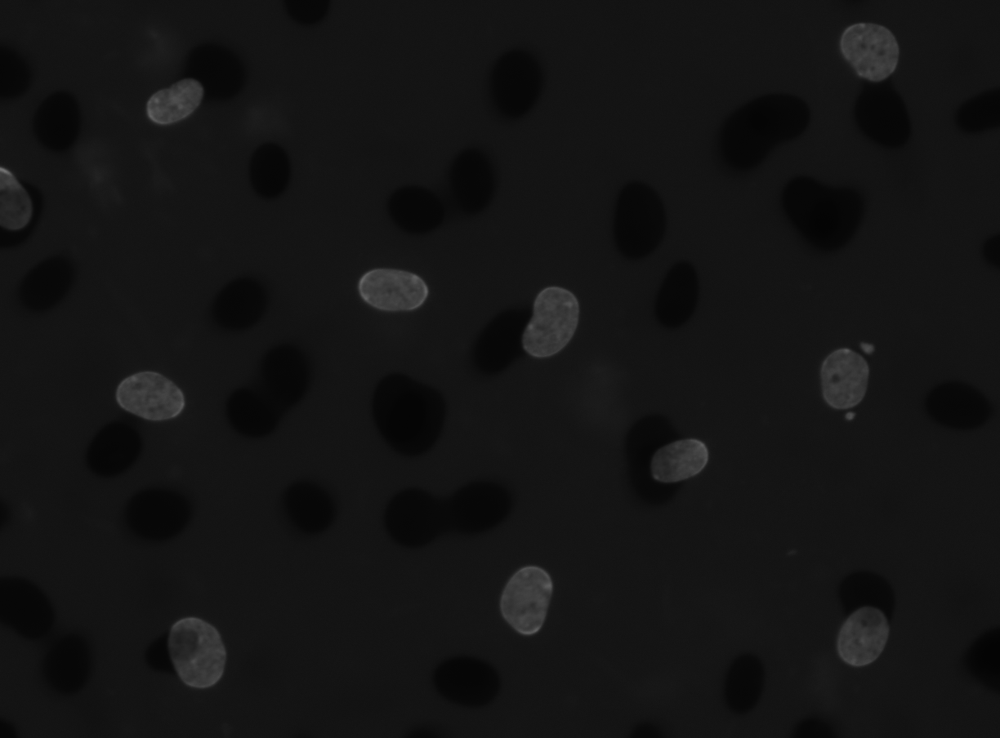
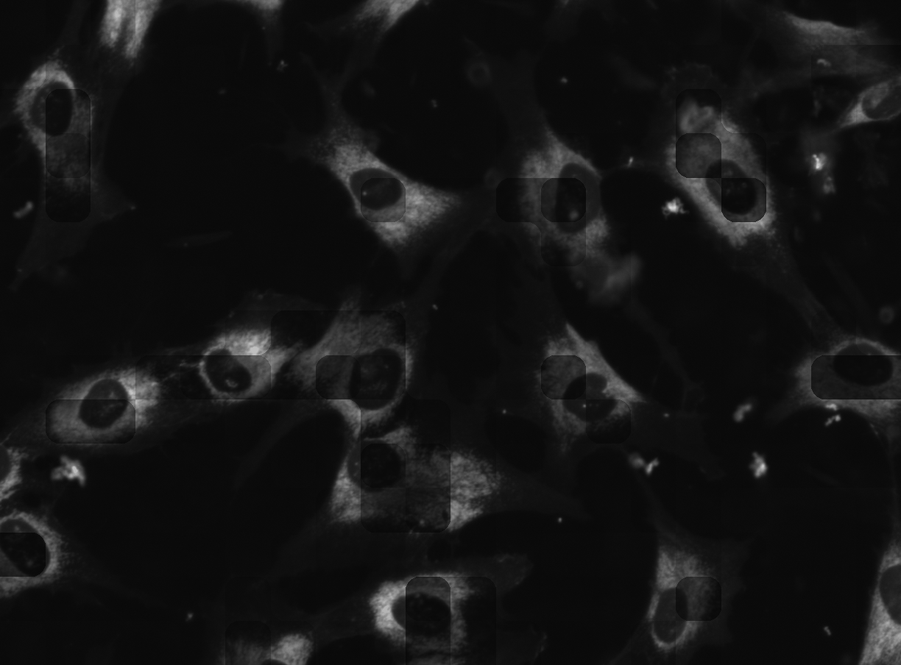

# Cell Profiler Illumination Correction Pipeline

In this module, I present the 10 CellProfiler pipelines I created using various manual parameters to create the illumination function calcuated from all of the images within the NF1 data set.

The parameters for each module to create an illumination function are the **same** for each channel.

The chosen image for comparison from the data set is **D6_01_1_4_DAPI_001.tif** because to the large artifact present in the bottom right corner. 
I chose this image because in the [CellProfiler illumination correction tutorial](https://cellprofiler-examples.s3.amazonaws.com/ExampleIlluminationCorrection_Tutorial.pdf), it gives an example of an image with a large artifact that was removed using illumination correction. 

Based on this, I wanted to see how these pipelines did with an one image from the NF1 data set that contained a large artifact and assess if the pipelines could remove it like in the example.

## Opinions for each pipeline

Below I provide my opinions regarding each pipeline, how the illumination correction function performed on the chosen image, and how it performed in general with all of the images.

### Formatting of the pipeline titles

The pipelines have titles that are meant for you to input into CellProfiler in order. Here is the parameters that I changed for these pipelines and the options within them:

#### CorrectIlluminationCalculate Module

- "Select how the illumination function is calculated": `Regular` or `Divide`
- "Dilate objects in the final averaged image?": `Yes` or `No`
    - If `Yes`, set "Dilation Radius" to specific value
- "Calculate function for each image individually, or based on all images?": `Each`, `All: Across Cycles`, or `All: First Cycle` 
- "Smoothing Method": `No smoothing`, `Convex Hull`, `Fit Polynomial`, `Median Filter`, `Gaussian Filter`, `Smooth to Average`, or `Spline`
- "Method to calculate smoothing filter size": `Automatic`, `Object Size`, or `Manually`
    - If `Object Size` or `Manually`, set value for `Approximate object diameter` or `Smoothing filter size` respectively

#### CorrectIlluminationApply Module

- "Select how the illumination function is applied": `Divide` or `Subtract`

**For more information on these modules and what the parameters do, please reference the CellProfiler documentation for the [CorrectIlluminationCalculate module](http://d1zymp9ayga15t.cloudfront.net/content/Documentation/cp2.1_2.2manual/CorrectIlluminationCalculate.html) and [CorrectIlluminationApply module](http://d1zymp9ayga15t.cloudfront.net/content/Documentation/cp2.1_2.2manual/CorrectIlluminationApply.html).**

### Regular -> Each image -> Median -> Manual 40 -> Divide

- Fast runtime.
- All images are very dim, hard to tell if illumination correction occurred.
- Must brighten images to see the objects.
- For the chosen image, once brightened in ImageJ, it looks like the nuclei have become darker in the center and then brighter on the edges.
    - Due to this, this pipeline is likely not viable as it could impact the biological anaylsis.

### Regular -> All: Across Cycles -> Median -> Manual 40 -> Divide 

- Much slower runtime, approximately 12 minutes.
- Creates a weird "shadow" effect, where in all the images, there looks to be dark shadows of the object being stained for based on the channel. 
See example below from the DAPI channel:

- This shadow issue can really be seen in the chosen image, where the shadows can be seen all over the artifact.
- Seems to be that the "All: Across Cycles" parameter causes there to be reminants of other images on each image

### Background (Block 60)-> Each image -> Median -> Manual 40 -> Divide

- Fast runtime.
- Creates faint boxes over objects for majority of the images in the data set. See example below from the GFP channel:

- For the chosen image, it is obvious that there are huge squiggly lines over the artifact that expand over the nuclei in the top right corner.
    - This indicates to me that the function used to correct these images is not working properly.
- Note: Divide parameter is not what is recommended for using the Background parameter based on the [CellProfiler documentation](http://d1zymp9ayga15t.cloudfront.net/content/Documentation/cp2.1_2.2manual/CorrectIlluminationApply.html), it should be set to Subtract.
    
### Regular -> Each image -> Median -> Manual 100 -> Divide

- Fast runtime.
- Objects within the images can be seen a tiny bit easier than with the parameter "Median (Manual 40)".
- Most of the objects with in the GFP and RFP channel images are still impossible to see clearly to the human eye.
- All images from the DAPI channel show nuclei with "holes".
- As seen in the chosen image from this pipeline, the artifact is missing but all of the nuclei have a very dark center ("hole").
    - Would not be recommended for downstream analysis since this function has caused the nuclei to look unnatural.

### Regular -> Dilate 1 -> Each image -> Median -> Manual 200 -> Divide

- This pipeline does very well with the DAPI channel, all nuclei are not distorted.
- Both GFP and RFP channels objects are still dim and the illumination correction function works differently between them.
    - Noticably, the RFP channel has random very dark areas.
- In the chosen image, the artifact has been completely removed along with a nuclei at the top right of the image.

### Regular -> Each image -> Median -> Manual 500 -> Divide

- This pipeline works similarly as the pipeline above, where the GFP and RFP channels are brighter but have weird dark areas.
- In the chosen image, the artifact is still there but the nuclei in the top right corner is not impacted (still visible).

### Regular -> Each image -> Median -> Automatic -> Divide

- Images all come out very dark and hard for the human eye to interpret for prototyping with in downstream pipelines.
- In the chosen image, when brightened in ImageJ, the nuclei are obviously distorted and likely impact the biological analysis.

### Background (Block 200)-> Each image -> Median -> Manual 40 -> Divide

- The DAPI and GFP channels seemed to be corrected for and didn't show any distortion expect for in the chosen image where the artifact has odd lines within it.
- Note: Divide parameter is not what is recommended for using the Background parameter, it should be Subtract 

### Regular -> Dilate 50 -> Each image -> Median -> Manual 200 -> Divide

- First attmepted with Dilate 100, but it does not work due to a memory error. 
- Dilation seems to take up a lot of effort from the computer when it is increased.
    - I left it to run overnight and it was at 18 hours of runtime and it was not finished.
    - Finished at about 20 hours.
- DAPI and GFP channels with this method seemed to come out with no distortions and the illumination corrected, but the when brightening the images up, the background around the objects (like a vignette) are dimmer than the rest of the background. 
This can be seen when brightening up the chosen image.
- RFP channel images were very dim.

### Background (Block 60) -> Each image -> Median -> Manual 40 -> Subtract

- All images became blank after using the recommended parameter via the [CellProfiler documentation](http://d1zymp9ayga15t.cloudfront.net/CPmanual/CorrectIlluminationApply.html).
- Even when trying to brighten the chosen image in ImageJ, all of the nuclei are gone and it can't be brightened.

## Main Conclusion

I believe after completing all of these pipelines, that these pipelines need to be updated per channel and the set parameters can not be universal for all channels. 
This does mean that more time will be spent changing the parameters to be "the best" for each channel, but it is necessary since one channel can work perfectly with one set of parameters but for another channel it is awful with that same set of parameters.